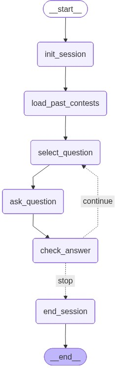

# 🤖 Gauss Math Test Practice AI Agent

> **캐나다 Gauss 수학 경시대회** 기출문제를 활용하여 7~8학년 학생들의 실력 향상을 돕는 인터랙티브 **LangGraph 퀴즈 에이전트**입니다.

---

### 🎯 프로젝트 목적
캐나다 Grade 7/8 학생들이 과거 Gauss 시험 문제를 통해 실전처럼 연습할 수 있는 간단하고 직관적인 학습 환경을 제공합니다.

### 🚀 핵심 기능
*   **학년 맞춤 설정**: 학생의 수준에 맞춰 **Grade 7** 또는 **Grade 8** 중 선택 가능.
*   **기출문제 자동 출제**: Gauss 과거 문항 데이터를 기반으로 한 문제씩 순차적 출제.
*   **실시간 피드백**: 정답/오답 자동 채점 및 문제별 **핵심 해설** 제공.
*   **학습 현황 추적**: 현재 세션 내에서 풀이한 **문제 수**와 **누적 점수** 업데이트.

# 다음의 url로 부터 특정 년도와 학년에 맞는 문제뱅크와 정답을 메모리에 담는 Tool에 대한 솔루션필요
#    problem_url = f"https://cemc.uwaterloo.ca/sites/default/files/documents/{year}/{year}Gauss{grade}Contest.html"
#    solution_url = f"https://cemc.uwaterloo.ca/sites/default/files/documents/{year}/{year}GaussSolution.html"
---

### 🏗️ 그래프 구조 (Graph Structure)
본 에이전트는 **LangGraph**를 활용하여 문제 선택, 풀이, 채점의 흐름을 상태 기반으로 관리합니다.

---

### 🛠️ 기술 스택 및 데이터
*   **프레임워크**: LangGraph / LangChain
*   **데이터 소스**: Gauss Math Contest Past Papers
*   **주요 로직**: 상태 기반 전이 (State-based Node & Edge)

